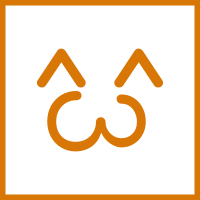
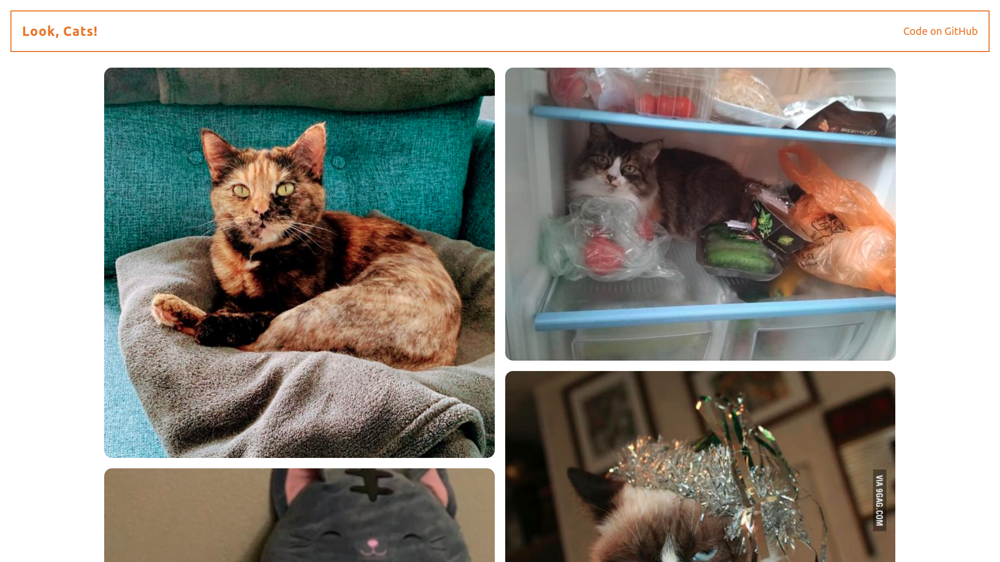

# Look, Cats!



[](https://github.com/Seryiza/look-cats/actions/workflows/deploy.yml)
[](https://codeclimate.com/github/Seryiza/look-cats/maintainability)



Бесконечная лента с фотографиями кошечек и фактов о них. Помогает отвлечься и расслабиться.

## Особенности
- Фото кошек
- Факты о кошках
- Кнопка, чтобы загрузить больше кошек! :)

## Как запустить
```sh
npm run serve  # hosted on localhost:1234
npm run test   # run tests
```

Деплой происходит через GitHub Actions с публикацией на GitHub Pages (ветка `gh-pages`).

## Источники данных
- Фото: [Cataas](https://cataas.com/)
- Факты: [Cat Facts](https://alexwohlbruck.github.io/cat-facts/)
